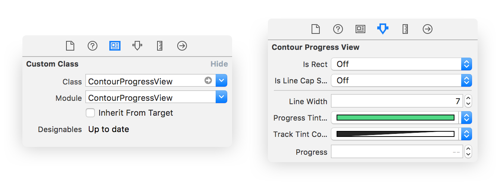

<p align="center">
    
</p>

## About
`ContourProgressView` is a `UIView` subclass that can be used to depict the
progress of a task over time. In contrast with Apple's `UIProgressView`, a `ContourProgressView`
follows the edges of a view.

## Usage with Storyboard
Drag a UIView onto the canvas and connect it to the ContourProgressView Class in the
Identity Inspector. Adjust properties in the Attribute Inspector to manage the design.
<p align="center">
    
</p>

## Usage with Code
A full screen rectangular progress view, with the `public` properties explained:
```swift
//// A convenience initializer for specifying the shape
let rectProgressView = ContourProgressView(frame: view.bounds, isRect: true)

//// The shape of the endpoints of the progress line (squared or rounded)
rectProgressView.isLineCapSquared = true

//// The color of the underlying 'track' line
rectProgressView.trackTintColor = .clear

//// The color of the progress line
rectProgressView.progressTintColor = .white

//// The line width of both the track and progress line
rectProgressView.lineWidth = 2

view.addSubview(rectProgressView)

//// Update the progress (download progress, scrollview offset etc.)
rectProgressView.progress = totalBytesWritten / totalBytesExpectedToWrite
```

## Requirements
iOS 8.0 and Swift 3.0.

## Installation
ContourProgressView is available through [CocoaPods](http://cocoapods.org). To install
it, simply add the following line to your Podfile:

```ruby
pod 'ContourProgressView', :git => 'https://github.com/Bajocode/ContourProgressView', :tag => '1.0.0'
```

## Author

I'm [Fabijan Bajo](http://www.fabijanbajo.com).
Email: [bajo09@gmail.com](mailto:bajo09@gmailcom)
Twitter: [@FBajo](http://twitter.com/FBajo).

## License

`ContourProgressView` is available under the MIT license. See the [LICENSE](LICENSE) file for more info.
